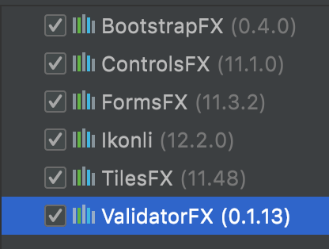

# Useful links
<ol>
  <li>
    Used FX frameworks 
    
  </li>
  <li><a href="https://search.maven.org/">Maven.org dependencies repository search</a></li>
  <li><a href="https://www.figma.com/">Figma</a></li>
  <ul>
    <li><a href="https://help.figma.com/hc/en-us/articles/360040328653-Use-shortcuts-and-quick-actions">Shortcuts Figma</a></li>
  </ul>
  <li><a href="https://lottiefiles.com/">Lottie Files</a></li>
  <li><a href="https://fontawesome.com/">Fontawesome</a></li>
  <li><a href="https://fontello.com/">Fontello</a></li>
  <li><a href="https://cssgradient.io/">CSS Gradient</a></li>
  <li><a href="https://fonts.google.com/">Google Fonts</a></li>
  <li><a href="https://www.toptal.com/designers/subtlepatterns/">Toptal</a></li>
  <li><a href="https://www.tutorialspoint.com/reactjs/reactjs_environment_setup.htm">ReactJS - tutorial</a></li>
</ol>
